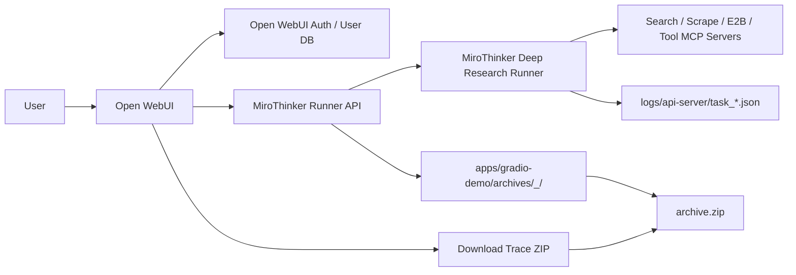

# Draft: Open WebUI 化 MiroThinker + 研究过程归档下载

## 1. 目标

将当前 MiroThinker Deep Research 的 Gradio demo 升级为以 Open WebUI 为主入口的产品形态：

- Open WebUI 负责用户注册、登录、会话、布局、用户数据库和基础 API 权限。
- MiroThinker 继续负责 Deep Research 后端能力，包括搜索、网页抓取、工具调用、状态流、验证过程和最终报告生成。
- 每次研究任务完成、失败或取消后，都在本地生成可追溯归档，并允许当前 Open WebUI 用户下载自己的归档压缩包。

本阶段不是重写 MiroThinker agent，也不是从零实现一个新用户系统。目标是做一层清晰的 Runner API 和 Open WebUI 接入，让正式用户入口从 Gradio 迁移到 Open WebUI，同时保留 Gradio 作为开发 fallback。

## 2. 官方依据与实现取向

Open WebUI 已经具备认证、用户、数据库、会话和 API 基础能力。本项目应复用这些能力，而不是重复实现用户系统。

参考文档：

- [Open WebUI Functions](https://docs.openwebui.com/features/extensibility/plugin/functions/)
- [Open WebUI Extensibility](https://docs.openwebui.com/features/extensibility/)
- [Open WebUI API Endpoints](https://docs.openwebui.com/reference/api-endpoints/)

重要取向：

- 新方案不要默认使用 Open WebUI Pipelines。Pipelines 已被官方标记为 legacy，新工作优先考虑 Functions/Tools 或普通后端 API。
- 第一版建议使用普通后端 API + Open WebUI 前端扩展/消息动作接入，保证任务流、归档下载、权限控制更直接可控。
- Open WebUI 的 Functions/Tools 可作为后续更深集成方向，但不要为了追求插件化而牺牲任务追踪和下载归档的可维护性。

## 3. 当前 MiroThinker 复用点

先审查并复用当前 Gradio demo 和 agent 侧已有实现，不要破坏旧行为。

重点代码锚点：

- `apps/gradio-demo/main.py`
  - `stream_events_optimized()`：当前研究过程事件流入口。
  - `_update_state_with_event()`：把 stream event 更新为前端展示 state。
  - `_render_markdown(state)`：把最终 state 渲染成 Markdown 报告。
  - `gradio_run()`：当前 Gradio 正式入口，可保留为 fallback。
- `apps/miroflow-agent/src/logging/task_logger.py`
  - `TaskLog` 和序列化逻辑：现有后端 trace 日志能力。
- `logs/api-server/task_*.json`
  - 现有 trace viewer 依赖的日志文件。新方案必须保留，不要改变或删除旧日志行为。

第一版应尽量把 MiroThinker 现有研究流程包装成 Runner，而不是把 agent 内部逻辑拆开重写。

## 4. 目标架构



核心边界：

- Open WebUI 是主前端和用户系统。
- MiroThinker Runner API 是 Open WebUI 和 MiroThinker agent 之间的后端适配层。
- Archive Writer 是 Runner API 的一个独立组件，负责收集 stream events、生成报告、写入文件和打包 zip。
- Gradio demo 可以继续运行，但不再是正式产品入口。

## 5. Runner API 设计

新增 MiroThinker Runner API，建议放在现有 `apps/gradio-demo` 或新增 `apps/mirothinker-runner` 中。第一版优先复用现有 Gradio 依赖和运行环境，减少迁移风险。

### 5.1 启动研究任务

`POST /mirothinker/research`

请求体：

```json
{
  "query": "研究问题",
  "client_options": {
    "stream": true
  }
}
```

认证：

- 请求必须来自已登录 Open WebUI 用户。
- Runner API 必须能拿到可信的 `user_id`。可以由 Open WebUI 后端代理时注入，也可以通过 Open WebUI 现有 token/session 验证得到。
- 不接受前端直接伪造 `user_id`。

响应：

```json
{
  "task_id": "uuid-or-existing-task-id",
  "status": "queued",
  "stream_url": "/mirothinker/tasks/{task_id}/events",
  "task_url": "/mirothinker/tasks/{task_id}"
}
```

### 5.2 研究过程事件流

`GET /mirothinker/tasks/{task_id}/events`

建议使用 SSE 作为第一版实现，原因是研究过程是服务端单向流，SSE 比 WebSocket 简单，浏览器和 Open WebUI 前端也更容易消费。

SSE event 示例：

```json
{
  "task_id": "xxx",
  "type": "search",
  "timestamp": "2026-06-06T12:00:00Z",
  "payload": {
    "query": "1260H list BYD",
    "results": []
  }
}
```

事件处理规则：

- Runner API 调用或包装 `stream_events_optimized()`。
- 所有非 `heartbeat` event 写入内存 trace buffer，并最终落盘到 `trace.json`。
- `heartbeat` event 只用于连接保活，不进入 `trace.json`。
- 每个 event 仍按现有逻辑进入 `_update_state_with_event()`，用于构建最终 state。
- 任务完成时调用 `_render_markdown(state)` 生成 `report.md`。

### 5.3 查询任务状态

`GET /mirothinker/tasks/{task_id}`

响应：

```json
{
  "task_id": "xxx",
  "query": "研究问题",
  "user_id": "open-webui-user-id",
  "status": "completed",
  "archive_status": "ready",
  "download_url": "/mirothinker/tasks/{task_id}/archive.zip",
  "created_at": "2026-06-06T12:00:00Z",
  "completed_at": "2026-06-06T12:10:00Z",
  "error": null
}
```

状态枚举：

- `queued`
- `running`
- `completed`
- `failed`
- `cancelled`

归档状态枚举：

- `pending`
- `ready`
- `failed`

### 5.4 下载归档

`GET /mirothinker/tasks/{task_id}/archive.zip`

权限规则：

- 普通用户只能下载 `user_id` 属于自己的任务归档。
- 管理员可选查看和下载全部归档，但必须走显式管理员权限判断。
- 如果任务未完成或归档未成功，返回明确错误，例如 `409 archive_not_ready`。
- 如果任务不存在或不属于当前用户，返回 `404`，避免泄漏他人 task_id 是否存在。

## 6. 归档文件合同

每次任务结束后，在以下目录创建归档：

```text
apps/gradio-demo/archives/<YYYYMMDD-HHMMSS>_<task_id>/
```

目录内必须包含：

```text
trace.json
report.md
metadata.json
report.html
archive.zip
```

### 6.1 trace.json

保存本次前端/服务端收到的所有非 `heartbeat` stream event。

格式：

```json
{
  "version": 1,
  "task_id": "xxx",
  "events": [
    {
      "type": "search",
      "timestamp": "2026-06-06T12:00:01Z",
      "payload": {}
    }
  ]
}
```

要求：

- 不包含 `heartbeat`。
- 尽量保持原始 event 结构，便于未来重放或 trace viewer 使用。
- 写入前必须经过 secrets scrubber，避免 API key、Authorization header、Bearer token、cookie 等进入归档。

### 6.2 report.md

保存最终 `_render_markdown(state)` 输出。

要求：

- 使用当前 MiroThinker 最终报告 Markdown，不另写一份报告生成器。
- 如果任务失败或取消，仍生成一个最小 `report.md`，说明状态、错误摘要和已有进度。

### 6.3 metadata.json

格式：

```json
{
  "version": 1,
  "task_id": "xxx",
  "query": "研究问题",
  "user_id": "open-webui-user-id",
  "start_time": "2026-06-06T12:00:00Z",
  "end_time": "2026-06-06T12:10:00Z",
  "status": "completed",
  "archive_status": "ready",
  "archive_filename": "archive.zip",
  "model": {
    "provider": "deepseek",
    "model": "deepseek-v4-pro",
    "base_url_host": "api.deepseek.com"
  },
  "error": null
}
```

安全要求：

- 不保存 API key。
- 不保存完整 Authorization header。
- 不保存 Bearer token。
- 不保存 cookie。
- `base_url` 只保存 host 摘要，例如 `api.deepseek.com`，不要保存带 query 或 secret 的完整 URL。

### 6.4 report.html

把 `report.md` 包进一个简单 HTML 文件，便于浏览器直接打开。

第一版可以使用极简模板：

```html
<!doctype html>
<html>
  <head>
    <meta charset="utf-8" />
    <title>MiroThinker Research Report</title>
  </head>
  <body>
    <main>
      <!-- rendered markdown or escaped markdown body -->
    </main>
  </body>
</html>
```

实现要求：

- 如果引入 Markdown 渲染库，必须保证 HTML 输出经过合理 sanitization。
- 如果不引入渲染库，第一版可以把 Markdown 作为 escaped `<pre>` 内容放入 HTML，优先保证安全和可读。

### 6.5 archive.zip

`archive.zip` 必须包含：

```text
trace.json
report.md
metadata.json
report.html
```

要求：

- zip 内不要包含绝对路径。
- zip 内不要包含 `.env`、日志目录、缓存目录或任何额外敏感文件。
- 创建 zip 失败不能导致研究任务失败，但必须记录 warning，并在任务状态接口显示 `archive_status: "failed"`。

## 7. 数据库与持久化

复用 Open WebUI 用户数据库，不新增独立注册/登录系统。

新增最小任务/归档记录表或等价持久化模型：

```text
mirothinker_research_tasks
```

字段：

```text
task_id          string primary key
user_id          string indexed
query            text
status           string
archive_status   string
archive_dir      text
archive_zip_path text
created_at       datetime
started_at       datetime nullable
completed_at     datetime nullable
error            text nullable
model_summary    json nullable
```

约束：

- `task_id` 必须唯一。
- `user_id + created_at` 建索引，便于用户查看自己的历史研究。
- 所有下载接口都必须通过这张表确认归属。
- 文件系统路径只由后端生成，不接受前端传入 archive path。

## 8. Open WebUI 前端改动

新增 Deep Research 入口或消息动作，第一版可以选其中一种：

### 8.1 独立 Deep Research 页面

适合把 MiroThinker 作为 Open WebUI 内的一个研究工作台：

- 输入研究问题。
- 点击 Start Research。
- 显示 Research Progress。
- 流式展示搜索、抓取、工具调用、状态验证和最终报告。
- 完成后在结果区域显示 `Download Trace ZIP` 按钮。

### 8.2 聊天消息动作

适合把 MiroThinker 作为 Chat 内的增强动作：

- 用户在一轮消息旁点击 Deep Research。
- Open WebUI 启动 MiroThinker Runner。
- 过程以一个研究结果卡片展示。
- 任务完成后在该卡片旁显示 `Download Trace ZIP`。

第一版默认选择：独立 Deep Research 页面 + 每轮研究结果旁下载按钮。这样状态流和归档更容易验证，后续再接入聊天消息动作。

下载按钮规则：

- `archive_status !== "ready"` 时禁用。
- `status === "completed"` 且 `archive_status === "ready"` 时启用。
- `status === "failed"` 或 `cancelled` 且已有可诊断归档时，也可以启用，但按钮文案可显示 `Download Diagnostic ZIP`。

## 9. Archive Writer 组件设计

新增 Archive Writer，建议实现为一个独立模块，例如：

```text
apps/gradio-demo/archive_writer.py
```

建议接口：

```python
class ResearchArchiveWriter:
    def __init__(self, archive_root: Path):
        ...

    def start(self, task_id: str, query: str, user_id: str, model_summary: dict) -> None:
        ...

    def record_event(self, event: dict) -> None:
        ...

    def complete(self, state: dict, status: str, error: str | None = None) -> ArchiveResult:
        ...
```

关键行为：

- `record_event()` 自动跳过 `heartbeat`。
- 写入文件前统一做 secret scrub。
- `complete()` 负责生成 `trace.json`、`report.md`、`metadata.json`、`report.html` 和 `archive.zip`。
- 归档失败时抛出可捕获异常或返回失败状态，不能打断主研究任务完成。

## 10. Secret Scrubber

必须在归档写入前做敏感信息清理。

需要过滤的内容包括但不限于：

- `API_KEY`
- `Authorization`
- `Bearer`
- `Cookie`
- `Set-Cookie`
- `SERPER_API_KEY`
- `JINA_API_KEY`
- `E2B_API_KEY`
- `OPENAI_API_KEY`
- `DEEPSEEK_API_KEY`
- `TENCENTCLOUD_SECRET_ID`
- `TENCENTCLOUD_SECRET_KEY`

建议策略：

- 对 event dict 做递归遍历。
- key 名命中敏感词时，value 替换为 `[REDACTED]`。
- string value 中匹配 `Bearer <token>` 时替换 token。
- string value 中匹配常见 key 前缀或长随机串时做保守脱敏。
- metadata 中只允许保存 provider、model、base_url_host，不保存完整 env。

## 11. 失败、取消与兼容性

失败和取消也必须归档：

- `metadata.json` 的 `status` 写为 `failed` 或 `cancelled`。
- `trace.json` 保存已收到的非 heartbeat events。
- `report.md` 写入已有进度和错误摘要。
- `archive.zip` 尽量生成。

兼容性要求：

- 保留现有 `logs/api-server/task_*.json` 行为。
- 不改变 MiroThinker core agent 的工具选择、搜索逻辑、模型调用逻辑。
- 不把 raw hidden chain-of-thought 作为产品承诺。归档内容只包括用户可见的 research progress、工具状态、验证过程、搜索/抓取结果和最终报告。

## 12. 分阶段实施计划

### Phase 1: MiroThinker Runner API 和归档能力

目标：

- 在现有 MiroThinker repo 中新增 Runner API。
- 包装 `stream_events_optimized()`。
- 新增 Archive Writer。
- 完成任务状态查询和 zip 下载接口。
- Gradio fallback 保持可运行。

验收：

- 不依赖 Open WebUI 前端，也能用 curl 启动任务、消费 SSE、下载 zip。
- `apps/gradio-demo/archives/` 下能生成完整归档目录。
- `logs/api-server/task_*.json` 仍正常生成。

### Phase 2: Open WebUI 接入

目标：

- Open WebUI 中新增 Deep Research 页面或消息动作。
- 通过 Open WebUI 当前用户身份调用 Runner API。
- 实时展示 Research Progress。
- 任务完成后显示 `Download Trace ZIP` 按钮。

验收：

- 登录用户可以完成一次 Deep Research。
- 页面展示过程事件、最终报告和下载按钮。
- 下载 zip 成功。

### Phase 3: 多用户隔离、管理员视图和回归测试

目标：

- 完成任务归属隔离。
- 增加管理员可选查看全部归档能力。
- 增加 secrets 泄漏检查测试。
- 增加失败/取消任务归档测试。

验收：

- 用户 A 不能下载用户 B 的归档。
- 管理员可以按权限查看全部。
- 测试覆盖成功、失败、取消、归档失败 warning、secret scrub。

## 13. 测试计划

必须完成以下测试：

1. 单用户完成一次 Deep Research 后，Open WebUI 页面能显示实时过程、最终报告和 `Download Trace ZIP`。
2. 下载 zip 后确认包含 `trace.json`、`report.md`、`metadata.json`、`report.html`。
3. 确认 `trace.json` 是合法 JSON，且不包含 `heartbeat` events。
4. 确认 `metadata.json` 是合法 JSON，包含 `task_id`、`query`、`user_id`、`start_time`、`end_time`、`status`、模型配置摘要和归档文件名。
5. 确认 `report.html` 可用浏览器打开。
6. 确认无 API key 泄漏：在归档目录和 zip 解压目录中搜索 `API_KEY`、`Authorization`、`Bearer`、实际 key 前缀。
7. 两个用户分别运行任务，互相不能下载对方归档。
8. 管理员权限路径单独验证，不和普通用户路径混淆。
9. 任务失败或取消时也生成 `metadata.json` 和可诊断的 `trace.json`，状态为 `failed` 或 `cancelled`。
10. 归档失败不能导致研究任务失败；Open WebUI 显示 warning，任务状态接口返回 `archive_status: "failed"`。
11. 保留现有 `logs/api-server/task_*.json` 行为，确保旧 trace viewer 仍可使用。

## 14. 非目标

本阶段不做：

- 不从零实现注册、登录、用户数据库。
- 不把 Gradio 扩展成正式多用户系统。
- 不默认采用 Open WebUI Pipelines。
- 不重写 MiroThinker core agent。
- 不承诺保存 raw hidden chain-of-thought。
- 不重新设计 DeepSeek、Serper、Jina、E2B 等环境变量体系。
- 不把 API key 或用户 token 写入归档。

## 15. 默认假设

- Open WebUI 是主用户系统。
- 第一版下载按钮放在每轮研究结果旁。
- 归档位置默认仍为 `apps/gradio-demo/archives/`，后续可迁移到 Open WebUI 后端 data 目录。
- 当前 DeepSeek、Serper、Jina、E2B 环境变量配置继续沿用。
- Runner API 和 Open WebUI 可以部署在同一台服务器上，第一版允许通过内网地址通信。
- 如果 Open WebUI 与 Runner API 分服务部署，必须配置服务间鉴权，不能把 Runner API 裸露成公开无鉴权接口。

## 16. 可直接交给 Codex 的执行提示词

请在 MiroThinker 仓库中实现 Open WebUI 化的 Deep Research 接入和研究过程归档下载。不要重写 MiroThinker core agent，不要从零实现用户系统。请复用 Open WebUI 的登录、注册、用户数据库和权限体系，把 MiroThinker 包装成 Runner API，并让 Open WebUI 调用它。

请先审查 `apps/gradio-demo/main.py` 中的 `stream_events_optimized()`、`_update_state_with_event()`、`_render_markdown(state)`，以及 `apps/miroflow-agent/src/logging/task_logger.py` 和现有 `logs/api-server/task_*.json` 行为。新实现必须保留旧 trace 日志，不要破坏 Gradio fallback。

请新增 Runner API：

- `POST /mirothinker/research`：由已登录 Open WebUI 用户启动任务，输入 query，返回 task_id、任务状态 URL 和事件流 URL。
- `GET /mirothinker/tasks/{task_id}/events`：用 SSE 推送非阻塞研究过程事件。
- `GET /mirothinker/tasks/{task_id}`：返回任务状态、归档状态和下载 URL。
- `GET /mirothinker/tasks/{task_id}/archive.zip`：下载归档 zip。

请新增归档能力：每次任务 completed、failed 或 cancelled 后，在 `apps/gradio-demo/archives/<YYYYMMDD-HHMMSS>_<task_id>/` 下写入 `trace.json`、`report.md`、`metadata.json`、`report.html` 和 `archive.zip`。`trace.json` 必须包含所有非 `heartbeat` stream event；`report.md` 必须来自最终 `_render_markdown(state)`；`metadata.json` 必须包含 task_id、query、user_id、start_time、end_time、status、模型配置摘要和归档文件名；`report.html` 是便于浏览器打开的简单 HTML；`archive.zip` 包含上述四个文件。

请实现用户隔离：普通用户只能查询和下载自己的任务归档，管理员可选查看全部。不要信任前端传入的 user_id，必须来自 Open WebUI 认证上下文或后端可信代理。归档路径必须由后端生成，不能由前端传入。

请实现敏感信息清理：任何归档文件都不能包含 API key、Authorization、Bearer token、cookie、Open WebUI token、DeepSeek/Serper/Jina/E2B/TencentCloud 等 key。metadata 中只允许保存 provider、model、base_url host 摘要，不保存完整 key 或 secret。

请在 Open WebUI 前端新增 Deep Research 入口或研究消息动作，第一版优先做独立 Deep Research 页面：用户输入 query 后显示实时 Research Progress，包括搜索、抓取、工具调用、状态验证和最终报告。任务完成且归档成功后，在每轮研究结果旁显示 `Download Trace ZIP` 按钮；任务失败或取消但生成诊断归档时，允许下载诊断 zip。

请不要默认使用 Open WebUI Pipelines；官方文档已说明 Pipelines 是 legacy。优先使用普通后端 API 或 Open WebUI Functions/Tools 方向。请不要把 raw hidden chain-of-thought 当作产品承诺；归档目标是用户可见的 research progress、工具状态、验证过程、搜索/抓取结果和最终报告。

完成后请运行测试，至少验证：单用户成功任务可展示和下载；zip 包含四个文件；JSON 可解析；HTML 可打开；trace 不包含 heartbeat；归档不包含 API key、Authorization、Bearer 或实际 key 前缀；两个用户互相不能下载对方归档；失败或取消任务也有 metadata 和 trace；旧 `logs/api-server/task_*.json` 仍可使用。
